# ConversionWise — Conversion Design PDP Template Teardown
**Source:** ConversionWise Meta ads (page `216135638510823`) — 215 live ads, 29 carousel cards read directly.
**Pulled:** 2026-07-10 · for the Scale House Landing Page Agent template library.

---

## TL;DR
ConversionWise runs ONE master template — a "Conversion Design" product page — as a **BEFORE → AFTER** teardown, re-skinned across 24+ niches (baby, beauty, tech, travel, supplements, apparel, pets, faith, sports, home, wellness). The repetition IS the proof: the same section order converts everywhere. Below is that structure + the actual creatives.

Their value ladder: problem-first hook ad → free "150+ point store diagnostic" → **$17 ConversionDesign Starter Kit** → done-for-you page design. Every static drives to `go.conversionwise.io/offer`.

---

## THE WINNING PAGE (the "AFTER" template)

### Zone 1 — Above the Fold
1. **Promo trust bar** (thin, top): `FREE SHIPPING ON ORDERS OVER $X`
2. **Outcome-based hero image** — emotional / lifestyle shot showing the RESULT, never a product-on-white studio shot.
3. **Benefit headline** — sells the outcome. Formula: `Outcome + Emotional benefit`.
   - "Better Sleep for Baby. Peace of Mind for You."
   - "Make More Putts. Lower Your Score. Play Your Best."
   - "Cleanse. Nourish. Glow Naturally."
   - "End Back Pain. Sit Better. Work Smarter."
4. **Star rating + review count** under headline — `4.9 ★ (2,341 reviews)` + `Loved by 20,000+ customers`.
5. **Hero video** — "Watch how it works" / "See it in action" in the hero.
6. **Price + primary CTA visible** without scrolling.

### Zone 2 — Trust & Proof (mid-page)
7. **Benefit icon row** — 3–5 icons naming key benefits ("Longer Sleep · Softer Nights · Calmer Baby").
8. **Certifications / trust badges** — Clinically Proven, FDA Cleared, Dermatologist Tested, Non-Toxic (critical for health/beauty/supplements).
9. **Before & After visual** (transformation products) OR **feature comparison table** ("us vs them" checkmark grid).
10. **Customer reviews with PHOTOS (UGC)** — verified-buyer tags + a named pull-quote.
11. **Benefit-led body copy** — scannable bullets, benefit first.

### Zone 3 — Convert (lower page)
12. **Bundle / upsell offer** — "Complete the routine", "Buy 2 Get 1 Free", tiered "Best Value". Raises AOV.
13. **Guarantees & endorsements** — 30-day money-back, warranty, practitioner endorsements.
14. **Sticky Add-to-Cart bar** — always visible, high-contrast, trust badges + light urgency.

---

## THE "BEFORE" — anti-patterns (our LP audit rubric)
1. **Generic product-only images** — studio shots, no lifestyle/outcome.
2. **No emotional / outcome connection** — copy describes the product, not the result.
3. **Weak social proof / trust signals** — low or hidden reviews, no certifications.
4. **Too many dropdowns / options** — selector friction stalls buyers.
5. **Hidden / low-contrast CTA** — buried below the fold, no urgency or clarity.

## THE 4 PILLARS (every card's footer)
**Trust → Clarity → Confidence → Conversion**

---

## VISUAL REFERENCE — annotated teardowns

### Canonical example (read the annotations top-to-bottom)
Baby sleep sack — the cleanest before/after of the set:
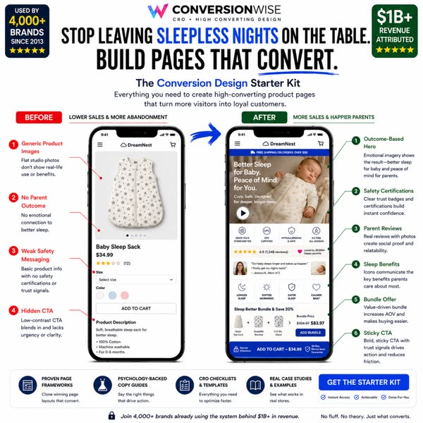

Supplement / health variant (note certifications + expert endorsement layer):
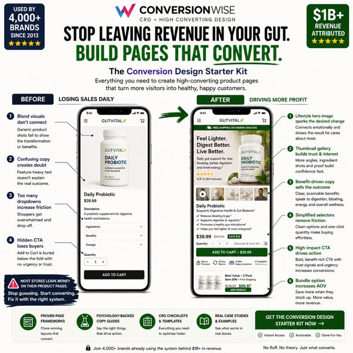
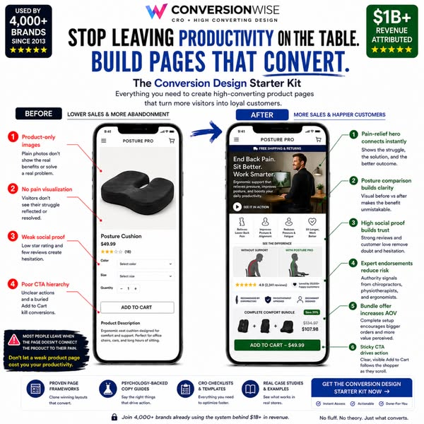

Beauty / transformation variant (before-after visual + video tutorial):
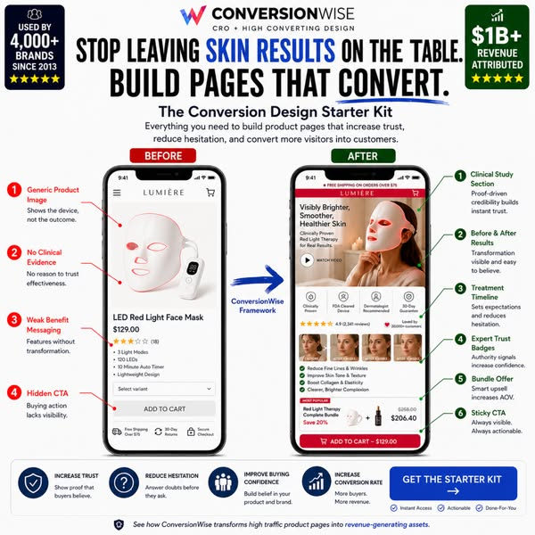
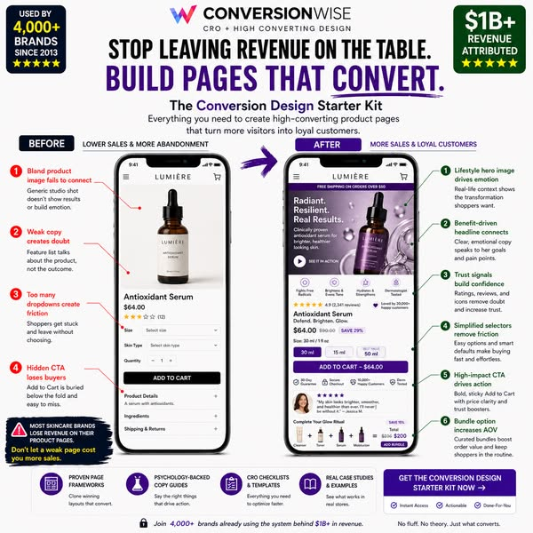

Apparel / lifestyle variant (thumbnail gallery + size selector de-frictioned):
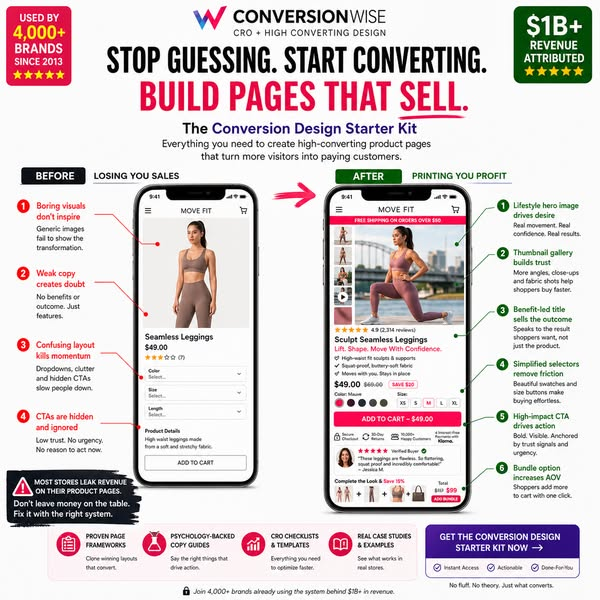
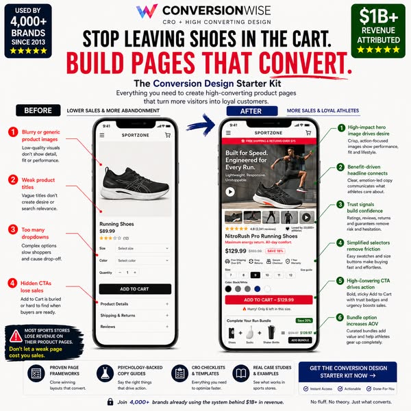

---

### Full niche gallery (same template, 24 verticals)
| | | |
|---|---|---|
|  baby sleep sack | 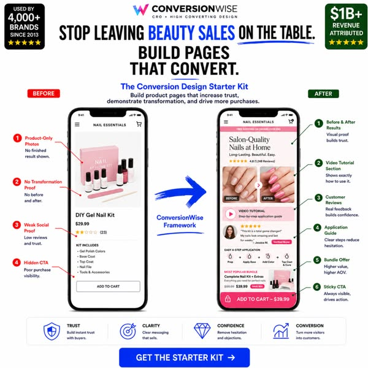 nail kit | 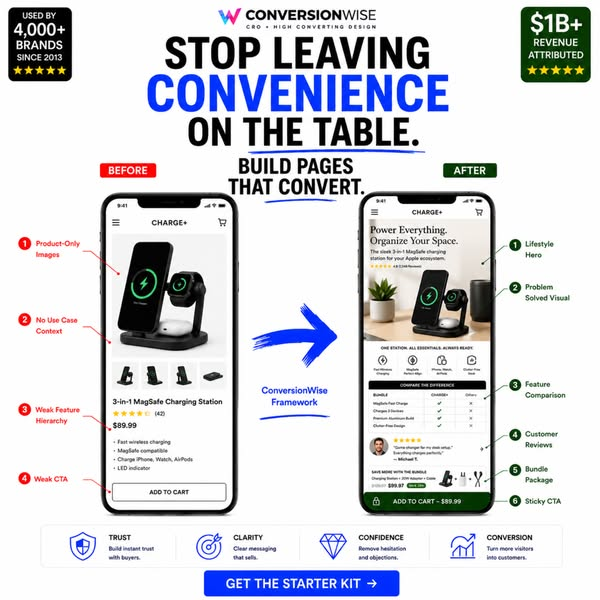 magsafe charger |
| 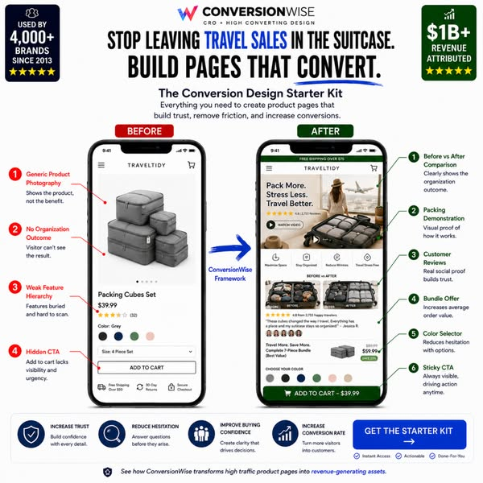 packing cubes | 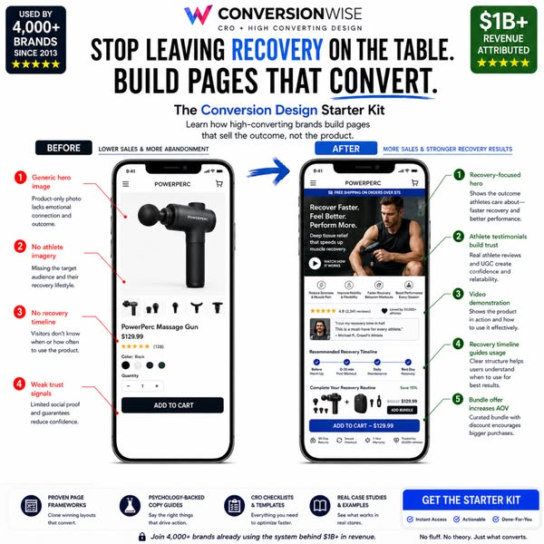 massage gun | 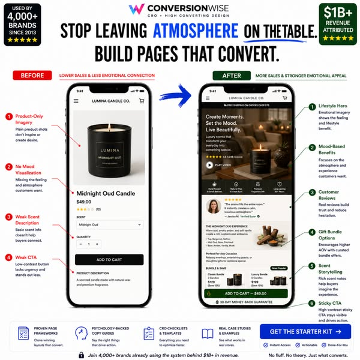 candle |
| 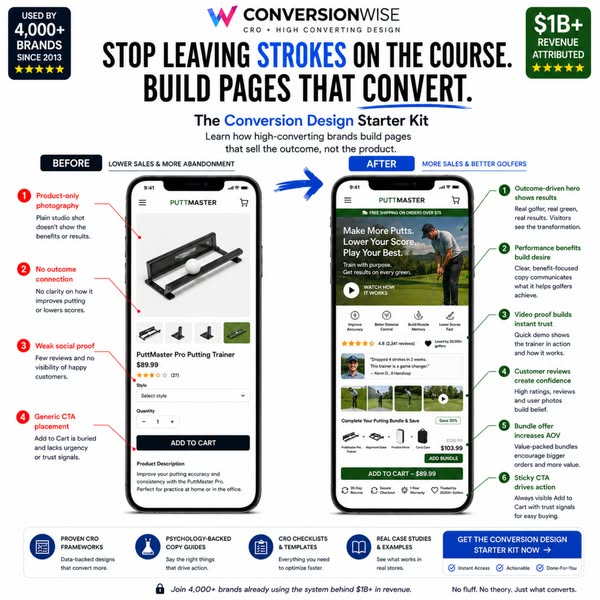 putting trainer |  leggings |  skincare serum |
| 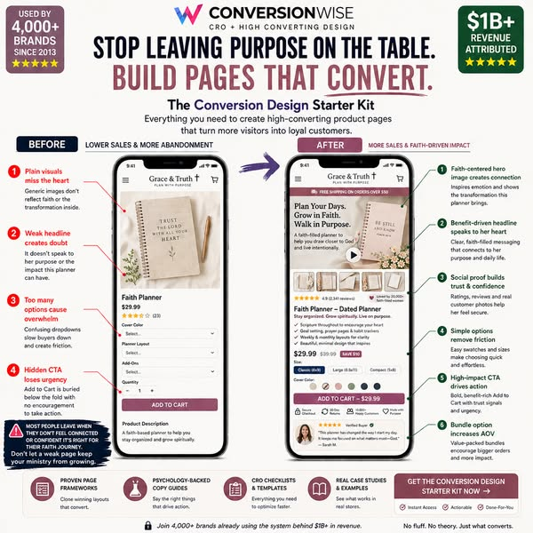 faith planner | 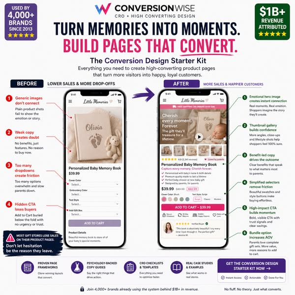 memory book | 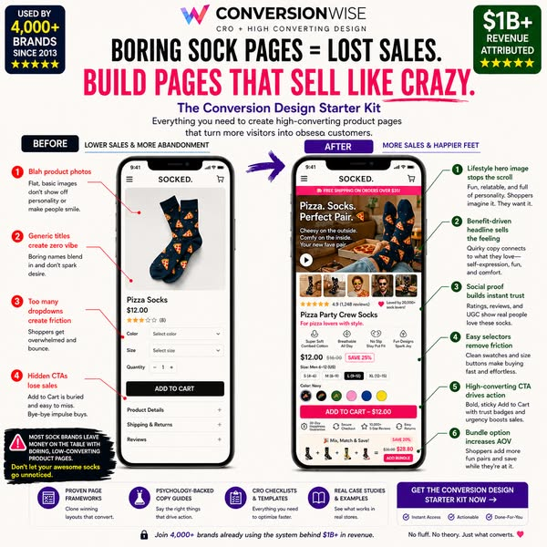 novelty socks |
|  probiotic | 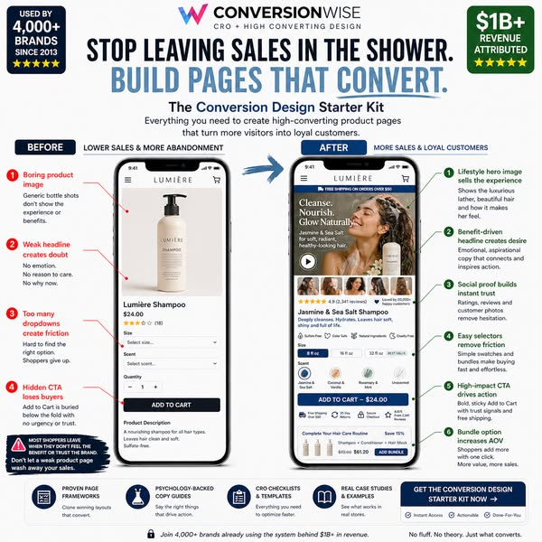 shampoo |  running shoes |
| 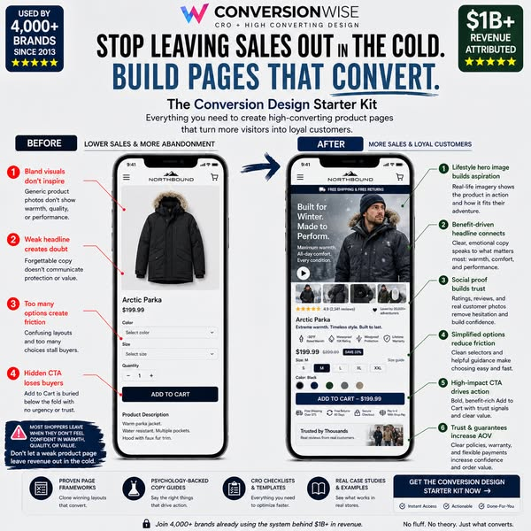 winter parka | 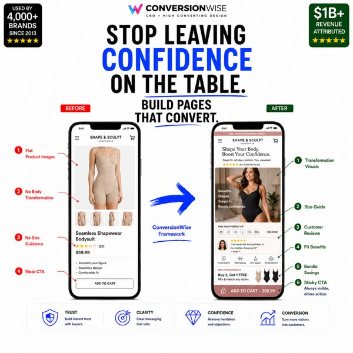 shapewear |  posture cushion |
|  LED face mask | 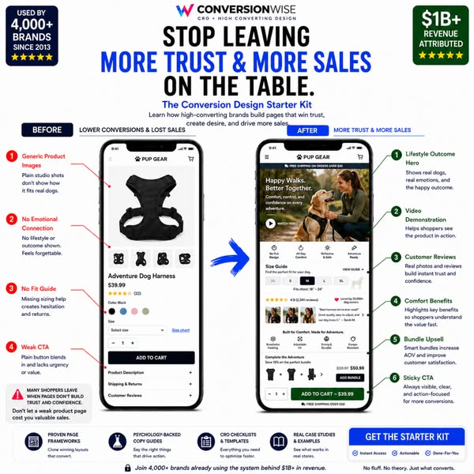 dog harness | 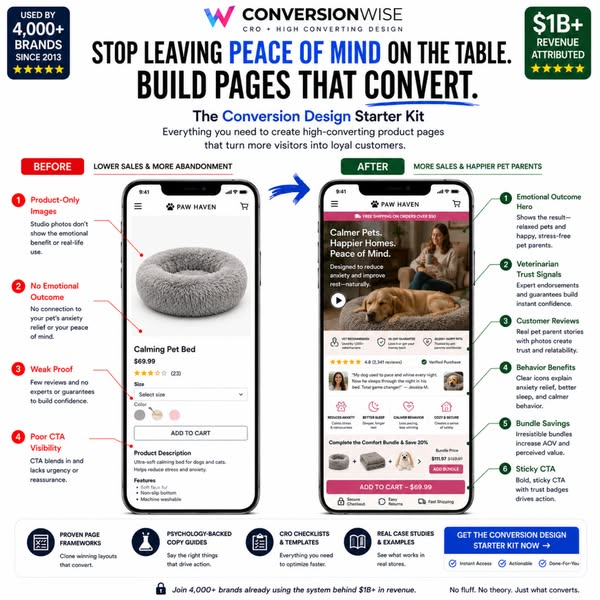 calming pet bed |
| 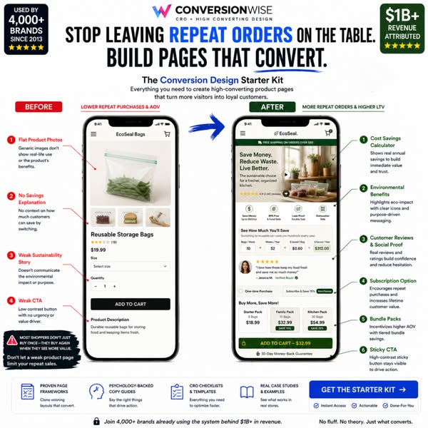 reusable bags | 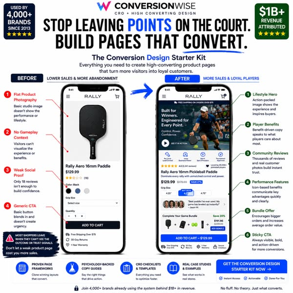 pickleball paddle | 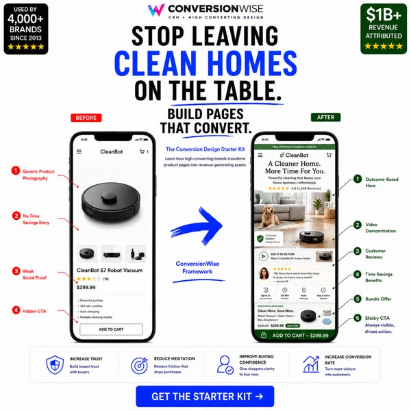 robot vacuum |

---

### Hook / VSL / offer creatives (angle intel, not templates)
"Everyone said it's the ads…" → it's what happens after the click:
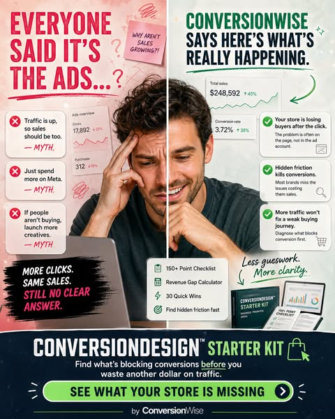

"Your brand looks beautiful, but your store still isn't selling enough":
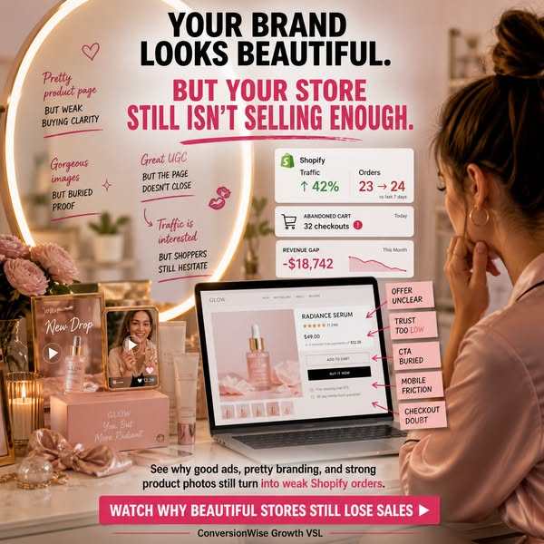

Proof wall — "Before they scaled, they found what was breaking" (BOOM +$3.2M, GFuel +$286k/mo, Cooking Guild +$5.6M, PuraU 7% CVR):
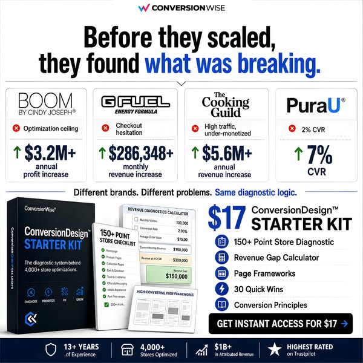

$17 ConversionDesign Starter Kit offer:
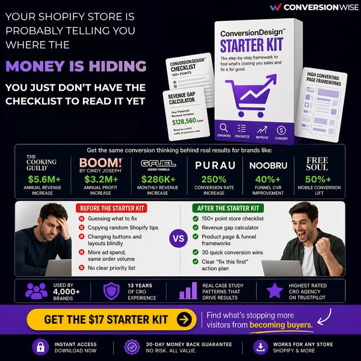

---

## → Built: the LP-Agent knowledge base
The teardown above has been fused with Scale House's full persuasion stack into a knowledge base the Landing Page Agent loads on every build:

**[`/knowledge-base`](./knowledge-base/)** — start with the **[`conversion-design-pdp` Master Blueprint](./knowledge-base/00-conversion-design-pdp-blueprint.md)**, backed by four deep-reference layers:
- [01 Conversion Psychology & CRO](./knowledge-base/01-conversion-psychology-cro.md) (25+ biases → on-page placement)
- [02 Persuasion Copywriting](./knowledge-base/02-persuasion-copywriting.md) (awareness stages, headline formulas, VoC)
- [03 Page Structure, Build & Instrumentation](./knowledge-base/03-page-structure-build-instrumentation.md) (mobile, CWV, forms, attribution, A/B)
- [04 Buyer Psychology & Niche Matrix](./knowledge-base/04-buyer-psychology-niche-matrix.md) (traffic source × 7-vertical adaptation)

The blueprint turns the CW AFTER-structure into a repeatable spec (7 pre-build inputs → section-by-section build → niche adaptation → QA gates), and wires the CW BEFORE anti-patterns in as the agent's pre-build audit rubric + pre-ship Proof Scorecard.
